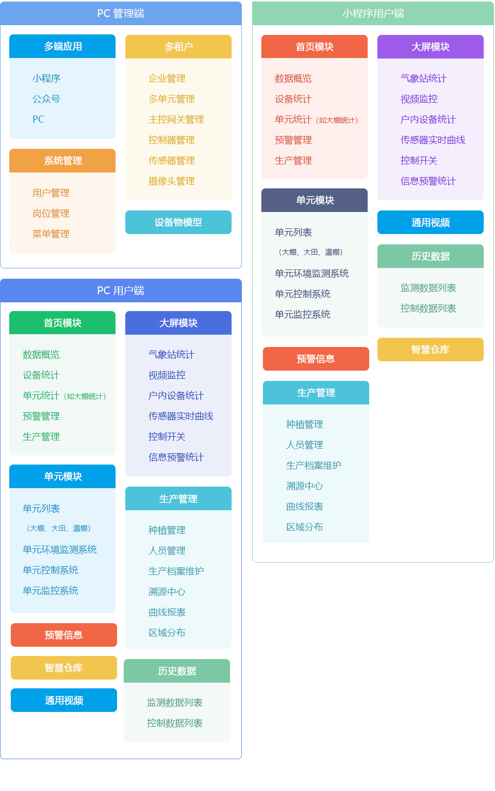
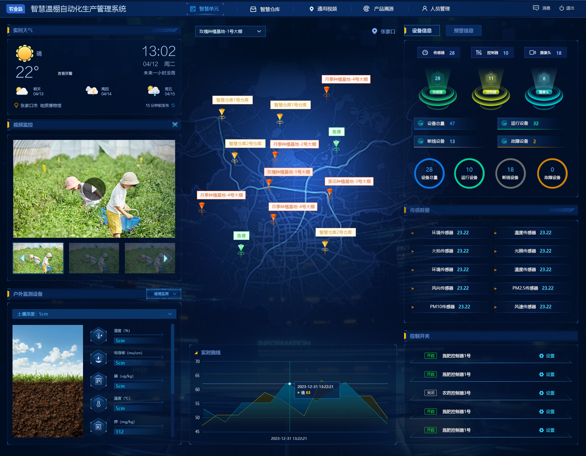
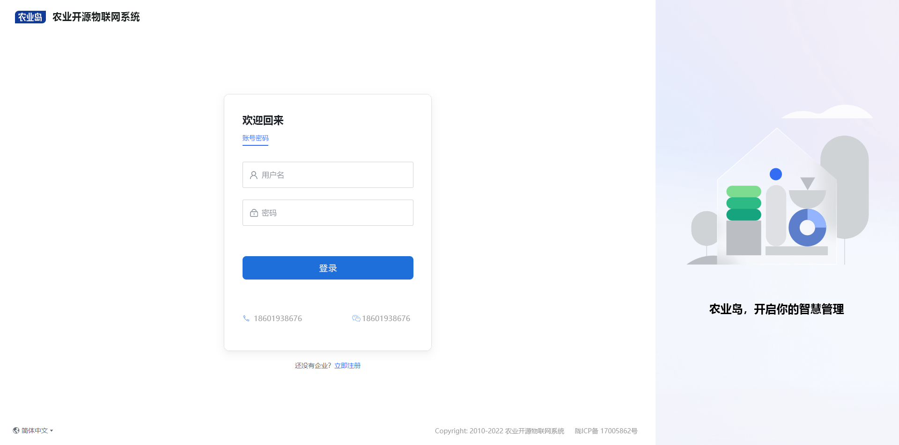
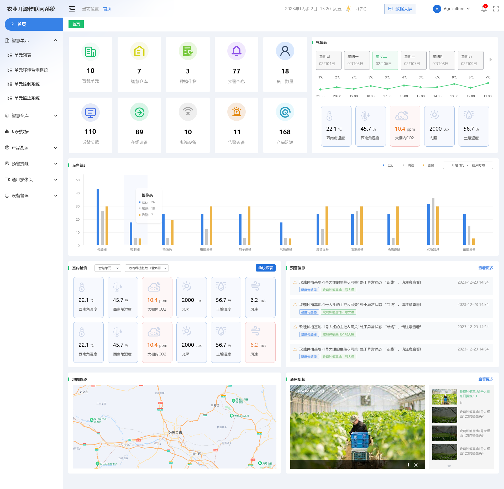
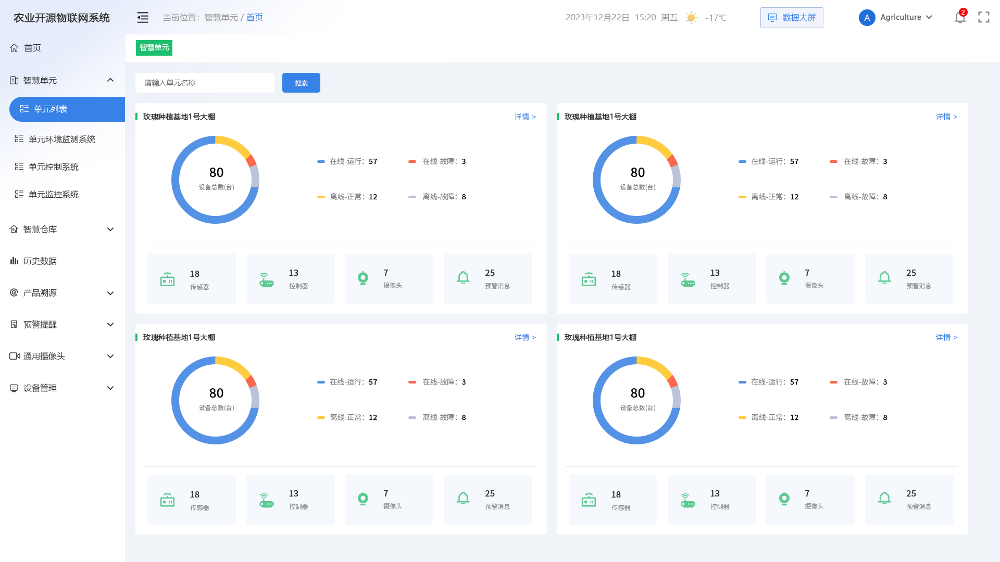
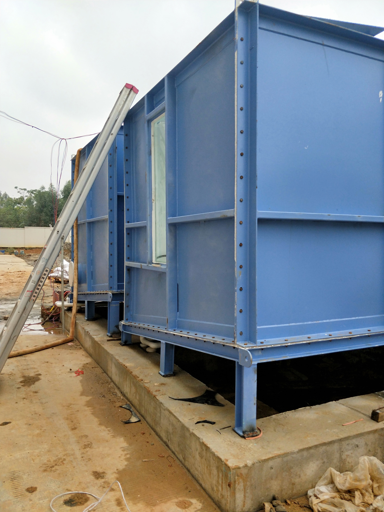

 

# 农业岛智慧农业系统Java版

    
    

[官网](http://nongyedao.nxptdn.com/) |
[在线体验](http://zhny-user-font.nxptdn.com) |
[帮助文档](http://nongyedao.nxptdn.com/) |
[技术社区](http://nongyedao.nxptdn.com/)

[comment]: <> ([宽屏预览]&#40;http://gitee.com/dnxt111/wisdom/blob/master/README.md&#41;)

    <a href="http://gitee.com/dnxt111/wisdom/blob/master/README.md">宽 屏 预 览</a>

    如果对您有帮助，您可以点右上角 "Star" ❤️ 支持一下 谢谢！

---

### 📖 简介：

农业岛 开源农业系统Java版，基于Java+Vue+Uni-app开发，在微信公众号、小程序、H5移动端都能使用，代码全开源无加密，独立部署，二开很方便，还支持免费商用，能满足气象站监控、温棚监控、高标准农田监控、仓库、报表统计、设备控制、设备物模型、大屏展示等多种经营需求，自用、做二开项目都很合适。

系统代码全开源无加密，独立部署、二开方便，适用于气象站监控、温棚监控、高标准农田、监控、仓库、报表统计、设备控制、设备物模型、大屏展示、多租户、视频系统、溯源系统等多种经营需求各种业务需求。

---

### 💡 系统亮点：

### 💡 重大亮点：多单元设计（根据不同的控制器和传感器组成不同的单元如大棚、大田、渔业、监控系统、灌溉系统等由你来构建更多场景）
>1.SpringBoot 框架开发业界主流。   

>2.【前端】Web PC 管理端 Vue + Element UI。 
>3.【前端】移动端使用 Uni-app 框架，前后端分离开发。 
>4.标准RESTful 接口、标准数据传输，逻辑层次更明确，更多的提高api复用。 
>5.支持Redis队列，降低流量高峰，解除耦合，高可用。 
>6.数据导出，方便个性化分析。 
>7.数据统计分析,使用ECharts图表统计，实现用户、产品、订单、资金等统计分析。 
>8.Spring Security 权限管理，后台多种角色，多重身份权限管理，权限可以控制到按钮级别的操作。 
>9.Vue表单生成控件，拖拽配置表单，减少前端重复表单工作量，提高前端开发效率。 
>10.使用物模型，实现设备的动态添加，提高物联网开发效率。 

---

### 💻 运行环境及框架：
~~~
1. 移动端uniapp开发框架 可生成H5 公众号 微信小程序
2. WEB Pc 管理后台使用Vue + Element UI 开发 兼容主流浏览器 ie11+
3. 后台服务 Java SpringBoot + Mybatis-plus + Mysql + redis
4. 运行环境 linux和windows等都支持,只要有Java环境和对应的数据库 redis
5. 运行条件 Java 1.8 Mysql5.7
~~~
---

### 🔧 Java项目框架 和 WEB PC 项目运行环境
~~~
1. SpringBoot 2.2.6.RELEASE
2. Maven 3.6.1
3. swagger-bootstrap-ui 1.0
4. Mybatis Plus 3.3.1
5. npm 6
6. node 14
7. vue 2.x
8. element ui 2.13
~~~

---

移动端 uniapp 开发 使用 HbuilderX 开发

---

### 🎬 系统演示：
WEBPC管理端：http://zhny-user-font.nxptdn.com/ 
账号密码： demo/nongyedao.com 

---

### 📃 系统资料
需要系统文档的朋友看过来，安装文档、产品介绍、技术文档...你想要的我都有！
[http://nongyedao.nxptdn.com](http://nongyedao.nxptdn.com/)

---
### 💻 讨论群：+v:18601938676

---

### 💟 UI界面

#### 核心功能

#### 大屏功能

### 📱 移动端预览

### WEB PC管理端预览

### 实际案例一（宁夏银川贺兰县渔业项目）

### 实际案例二（广州自然微生物集装箱渔业项目）

---
### 📲 农业岛开源技术交流群
扫码进群可领取开源版接口文档、产品功能清单、高清UI设计图、思维脑图！

#### 📈 技术社区
找方法、提bug、看官方消息、拿活跃大奖！
http://nongyedao.nxptdn.com/

#### 📞 技术交流
跟着官方，不迷路！欢迎扫码加入农业岛 开源项目群，一手消息及资源，尽在掌握！ 

使用中遇到bug 或者问题可以在gitee 上提 Issues

---

### 💌 特别鸣谢
核心开发团队

产品: 媛姐

技术: 大白熊阳光, 铁子猫, 峰白菜,张小驴

团队打杂: 慧总

UI: 周达白

测试: 强哥, 刚子

---

### 🔔 使用须知
1.允许用于个人学习、毕业设计、教学案例、公益事业、商业使用; 
2.如果商用必须保留版权信息，请自觉遵守; 
3.禁止将本项目的代码和资源进行任何形式的出售，产生的一切任何后果责任由侵权者自负。 

---
### 🪪 版权信息
本项目包含的第三方源码和二进制文件之版权信息另行标注。 
版权所有Copyright © 2017-2022 by 农业岛 (http://nongyedao.nxptdn.com) 
All rights reserved。 
农业岛® 商标和著作权所有者为农业岛所有。 

---